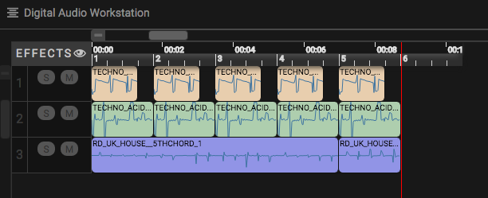

# Week Four EarSketch
---
##### 04/19/17
  * Today I learned about Pitch and how it changes the outcome of a song. I figured that pitch was pretty basic, about how high and low a note sounds. Yet, I learned that pitch is more gynamic and is actually a set of notes. Pitch also does not work alone, it is accompanied by duration, loudness, and timbre. EarSketch makes it easy by putting similar keys, in other words a group of pitches, in a folder so they sound well together when mixed in a song.
##### Refreshing Advice
  * Earsketch taught me that there is a difference from working code and setting a goal. A goal is something that you have pre-planned and want to see in action, and strive to get the idea to come together. Working code means there is no errors, but if it does not come across the way you want it to, you should not leave it the way it is. It is better to keep trying and find something you become proud of. Achieving the objective should be the main focus, and afterwards the coder should ask themselves these questions:
    1. How can I improve it?
    2. Does the code accomplish what I intended?
    3. Is the code simple and easy to understand?
##### 4/20/17
  * On todays lesson I learned about looping. Looping is similar to a funtion in coce, it allows you to create the same musical outpu by using less lines of code.
    * The way this is achieved is by using the for-loop.
     ```python 
       for i in range(2):
       # Anything that follows the colon has to be indented and will be able to be repeated several times in the song
    ```
#### Thoughts
  * At first I believed it would follow the same structure as #sound,tracknum,start,end in fit media. When I tried it, I got alot of errors of overwriting. I was confused, but after reading I saw that they used measure instead of a number. You could add measure + a number to decide how often it is replicated.After tinkering, I came up with this


```python
from earsketch import *
init()
setTempo(140)
for measure in range(1,6):
#range is thourgh which measures it plays, the last number is exclusive
  fitMedia(DUBSTEP_BASS_WOBBLE_008,1,measure,measure+0.25)
  fitMedia(TECHNO_ACIDBASS_001,1,measure,measure+.75)
  fitMedia(TECHNO_ACIDBASS_007,2,measure,measure+1)
#since this isnt indented, it is not part of the loop
fitMedia(RD_UK_HOUSE__5THCHORD_1,3,1,6)
finish()
```
#### Learnings
I was using measure + number, but the shorthand is += and -=
  * (+) adds to variable value
  * (-) subtracts from variable value
##### 4/22/17
#### Reflection/Advice 
1. Simplicity. If you get your code to work how you want, find ways to improve. It is not only benefical for you to make sure the concepts being taught are  well grasped by you, but it also prevents long tedious code. Also, by making the code essier, it gives you more working room . In the begining , i was using several lines just to get the musix to appear. Now, we can add effects and breaks using looping.
2. I want to emphasis that before you tinker, look at examples and read the whole section. It would have saved me some time, but instead I was rushing and tried to fit bumbers in the loop. I was confused to why it was not working. Once I took the time the problem was simple; All I had to do was type measure + a number to give the placement of the track. 