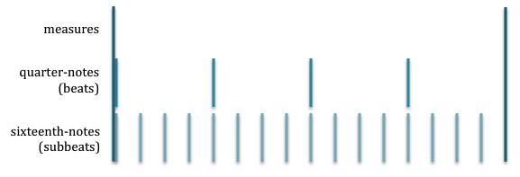

# Intro to Music Week Two 
---
### Important terms to understand
  * Tempo
    * speed of a song
    * measured in beats per minute (bpm)
  * Meter
  * Measure
  ##### Types of beats
  * Beat
    * Beat are grouped per measure. 
  * Sub-beat
 

  ###### Why are they useful?
  * It helps you use the DAW more efficently by helping you to organize the elements of your music in time.